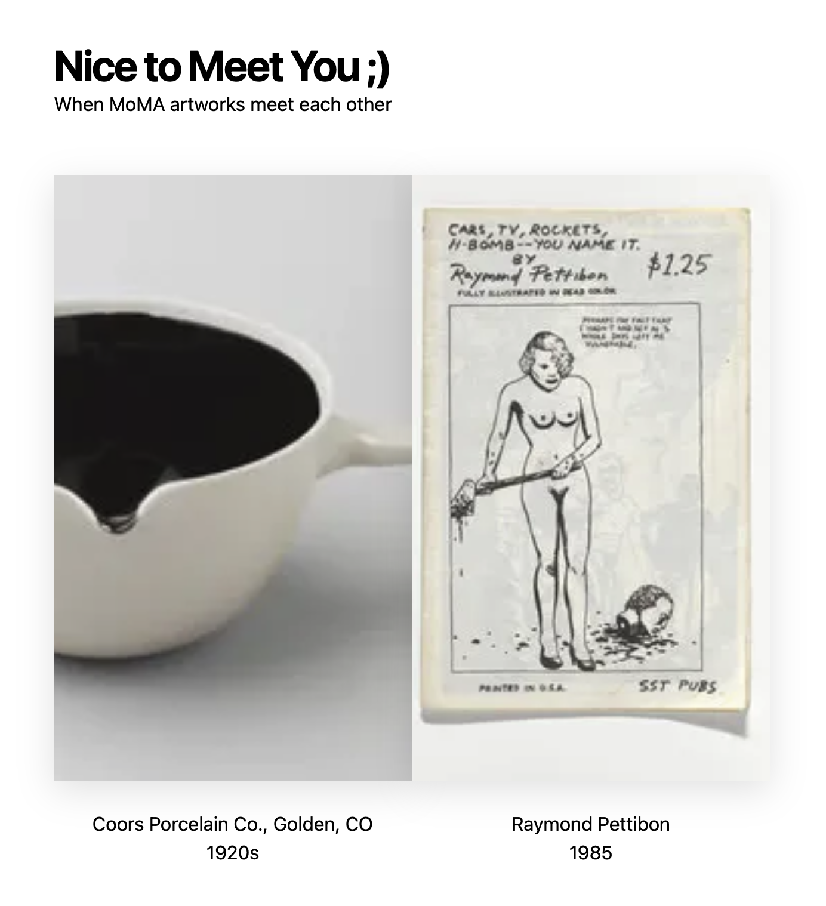

# Nice to Meet You

A fun website of discovering art using Next.js and TypeScript with [MoMA collection data](https://github.com/MuseumofModernArt/collection)



## Demo

[Hosted on Vercel](https://moma-artworks-discovery.vercel.app)

## How to use

```bash
npm install
npm run dev
```

The website should be up and running on [http://localhost:3000](http://localhost:3000)!

## Notes

- This hobby project is more focused on fun part and server-side rendering with Next.js instead of focuing on performance or UX.
- The idea is randomly pick up 2 images to create a diptych within the 153,825 artworks by 35,298 artists
- the main page and artist page is using SSR(server side rendering)
- This project uses [Tailwind CSS](https://tailwindcss.com) [(v3.0)](https://tailwindcss.com/blog/tailwindcss-v3).
